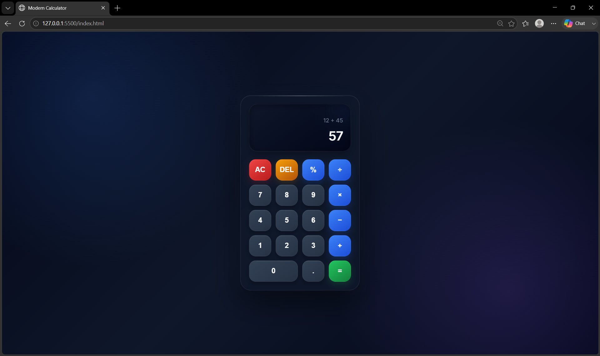

# 🧮 Modern Calculator

A responsive and interactive calculator built using **HTML, CSS, and JavaScript** with a clean and modern user interface.

## ✨ Features

- Addition, subtraction, multiplication, and division
- Percentage operation
- Decimal number support
- Clear (`AC`) and delete (`DEL`) functions
- Real-time display
- Error handling
- Keyboard support
- Responsive design
- Smooth button animations
- Modern and premium UI

## 🛠️ Technologies Used

- HTML5
- CSS3
- JavaScript

## 📂 Project Structure

```text
Calculator/
│
├── index.html
├── style.css
├── script.js
└── README.md